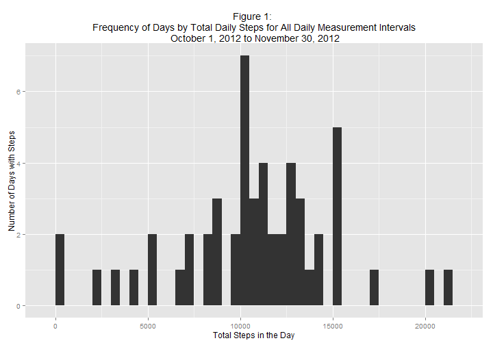
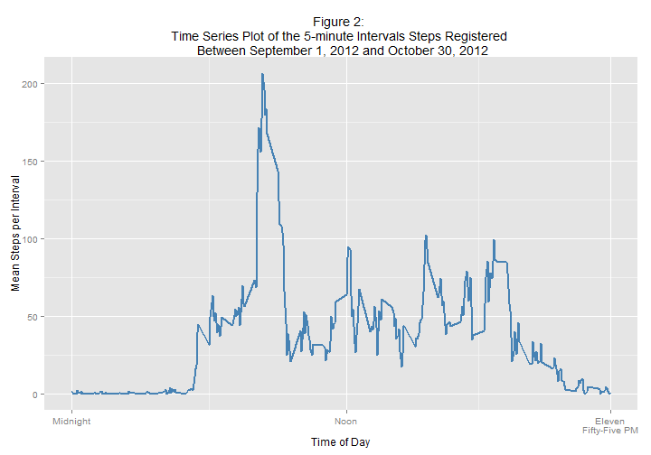
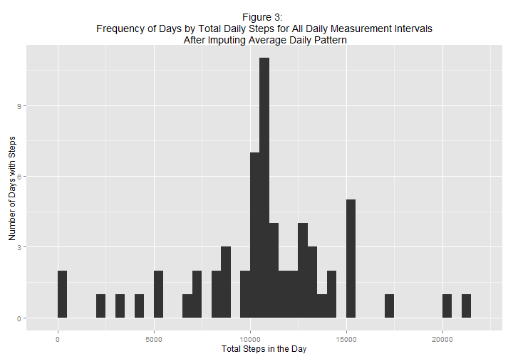
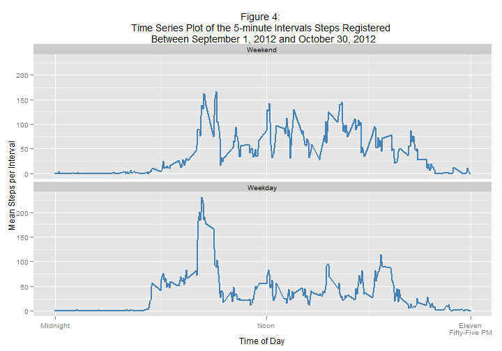

##Peer Review Assignment 1

### Loading and preprocessing the data

The zip file is downloaded from the course site and unzipped to activity.csv. The csv is read into the dataframe "data" which has 17,568 rows and 3 variables, steps, date and interval. The steps variable is a count of the number of steps taken on the particular date during a particular 5 minute interval.  The data represented 288 five minute intervals per day(60/5 x 24) and included 61 dates, October 1, 2012 to November 30, 2012. The interval variable was structured as an integer with the first 2 digits representing the hour starting at "zero" hour or 12:00 midnight up to hour twenty-three.  The digits three and four represented the minutes identifier ranging from minute zero to minute 55. The date variable was in character format and was converted to "date" format and then used to add another variable that identifies the day of the week by use of the lubridate package and the wday function. 

```r
url<-"http://d396qusza40orc.cloudfront.net/repdata%2Fdata%2Factivity.zip"

download.file(url, destfile = "activity.zip", mode="wb") 
unzip("activity.zip", files = NULL, list = FALSE, overwrite = TRUE,
      junkpaths = FALSE, exdir = ".", unzip = "internal",
      setTimes = FALSE)
data = read.csv("activity.csv", header=TRUE, row.names=NULL, stringsAsFactors=FALSE)
dim(data)
```

```
## [1] 17568     3
```

```r
data$date <- as.Date(data$date)
library(lubridate)
data$weekday<-wday(data$date, label=TRUE)
str(data)
```

```
## 'data.frame':	17568 obs. of  4 variables:
##  $ steps   : int  NA NA NA NA NA NA NA NA NA NA ...
##  $ date    : Date, format: "2012-10-01" "2012-10-01" ...
##  $ interval: int  0 5 10 15 20 25 30 35 40 45 ...
##  $ weekday : Ord.factor w/ 7 levels "Sun"<"Mon"<"Tues"<..: 2 2 2 2 2 2 2 2 2 2 ...
```


### What is the mean total number of steps taken per day?

When looking at the steps activity measure on a daily basis, one has to account for the fact that 8 full days of readings are missing.  There are 2304 intervals that are missing step values as represented by NA's.  All of the missing values are found in 8 days that are completely NA's.  Consequently, the analysis of steps activity takes into account 53 day, rather than the 61 days in the period of observation.  It is assumed that the activity monitor is switched off during this period, has been fully discharged or is malfunctioning.


```r
a<-aggregate(data$steps, by=list(data$date), FUN=sum)
mean(a$x, na.rm=TRUE)
```

```
## [1] 10766
```

```r
median(a$x, na.rm=TRUE)
```

```
## [1] 10765
```

The mean number of steps per day is 10,766 for the 53 days with the median being just slightly less at 10,765 steps. 

```r
require(ggplot2)
```

```
## Loading required package: ggplot2
```

```r
p=ggplot(a, aes(x=a$x)) + geom_histogram(binwidth = 500) +
       xlab("Total Steps in the Day") + ylab("Number of Days with Steps") +
       ggtitle("Figure 1: \nFrequency of Days by Total Daily Steps for All Daily Measurement Intervals\n October 1, 2012 to November 30, 2012")
p
```

 
The histogram in Figure 1 shows the general pattern of total steps per day. With the bin width of 500, the median value of 10,765 is found in bar just to the right of the tallest frequency bar where there are three days represented. 

###What is the daily activity pattern?

```r
b<-aggregate(data$steps, by=list(data$interval), "mean", na.rm=TRUE)
names(b)<-c("interval", "MeanSteps")
bb<-b[order(-b$MeanSteps),]
head(bb, n=1) #8:35 am is the interval with the highest average steps. 
```

```
##     interval MeanSteps
## 104      835     206.2
```

```r
ggplot(aes(x=interval, y=MeanSteps), data=b) + 
           geom_line(color = "steelblue", size = 0.8) + 
           labs(title = "Figure 2: \nTime Series Plot of the 5-minute Intervals Steps Registered \n Between September 1, 2012 and October 30, 2012", y="Mean Steps per Interval") + 
           scale_x_continuous(name="Time of Day", breaks=c(1,1200,2355), labels=c("Midnight",
           "Noon", "Eleven\nFifty-Five PM"))
```

 
The daily activity pattern calculation averages the 288 daily 5 minute intervals across the 53 days with monitor readings.  The interval with the highest average number of steps is the interval beginning 8:35 am.  As would be expected, early morning readings are extremely small, activity grows to a peak in the morning, generally varies widely within a band 25 step to 100 steps after that peak and through the early evening hours and then trails off markedly as midnight approaches.


### Imputing missing values


```r
sum(is.na(data$steps))
```

```
## [1] 2304
```

```r
unique(data$date[!complete.cases(data$steps)])
```

```
## [1] "2012-10-01" "2012-10-08" "2012-11-01" "2012-11-04" "2012-11-09"
## [6] "2012-11-10" "2012-11-14" "2012-11-30"
```
Reviewing the data, eight days made up of 2304 intervals missing data.  The missing days are: 
2012-10-01  
2012-10-08  
2012-11-01  
2012-11-04  
2012-11-09  
2012-11-10  
2012-11-14  
2012-11-30  
These missing days can be replaced with the mean daily activity pattern. This replace the missing values (NA) with the activity pattern for the eight the days. This pattern totals 10,766 steps for each of those days. 


```r
data$steps[data$date=="2012-10-01"]<-b$MeanSteps
data$steps[data$date=="2012-10-08"]<-b$MeanSteps
data$steps[data$date=="2012-11-01"]<-b$MeanSteps
data$steps[data$date=="2012-11-04"]<-b$MeanSteps
data$steps[data$date=="2012-11-09"]<-b$MeanSteps
data$steps[data$date=="2012-11-10"]<-b$MeanSteps
data$steps[data$date=="2012-11-14"]<-b$MeanSteps
data$steps[data$date=="2012-11-30"]<-b$MeanSteps
```


```r
aa<-aggregate(data$steps, by=list(data$date), FUN=sum)
mean(aa$x, na.rm=TRUE)
```

```
## [1] 10766
```

```r
median(aa$x, na.rm=TRUE)
```

```
## [1] 10766
```

```r
p2=ggplot(aa, aes(x=aa$x)) + geom_histogram(binwidth = 500) +
       xlab("Total Steps in the Day") + ylab("Number of Days with Steps") +
       ggtitle("Figure 3: \nFrequency of Days by Total Daily Steps for All Daily Measurement Intervals\n After Imputing Average Daily Pattern")
p2
```

 
The mean is not changed as we replaced the missing days with days of average step intervals.  The median changed slightly as we added 8 mean values to the 53 days.  As can be seen in figure 3, the eight days were added to the median interval making it the most frequent with 11 days. 


###Are there differences in activity patterns between weekdays and weekends?

```r
require(plyr)
```

```
## Loading required package: plyr
## 
## Attaching package: 'plyr'
## 
## The following object is masked from 'package:lubridate':
## 
##     here
```

```r
require(reshape2)
```

```
## Loading required package: reshape2
```

```r
data$WeekId<-revalue(data$weekday, c("Mon" = "Weekday","Tues"="Weekday","Wed"="Weekday","Thurs"="Weekday","Fri"= "Weekday", "Sun"= "Weekend", "Sat" = "Weekend"))

c<-aggregate(data$steps, by=list(data$interval, data$WeekId), "mean", na.rm=TRUE)
names(c)<-c("interval", "WeekId", "MeanSteps")
d<-melt(c, id=c("WeekId","interval"))
ggplot(aes(x=as.integer(interval), y=value, group = WeekId), data=d) + 
           geom_line(color = "steelblue", size = 0.8) + 
           labs(title = "Figure 4: \nTime Series Plot of the 5-minute Intervals Steps Registered \n Between September 1, 2012 and October 30, 2012", y= "Mean Steps per Interval") + 
           scale_x_continuous(name="Time of Day", breaks=c(5,1200,2355), labels=c("Midnight",
           "Noon", "Eleven\nFifty-Five PM")) +
           facet_wrap(~WeekId, ncol=1) 
```

 

```r
mean(c$MeanSteps[c$WeekId=="Weekend"])
```

```
## [1] 42.37
```

```r
mean(c$MeanSteps[c$WeekId=="Weekday"])
```

```
## [1] 35.61
```

Figure 4 shows the difference in activity pattern between weekends and weekdays.  The mean weekday activity is 35.6 steps per interval while the mean weekend activity is 42.4 steps per interval.  

The differences between the weekend and weekday activity are logical.  Step activity by a working person could peak when they are going to work during the morning hours then during the rest of the day that person is sitting and moving about sproadically with many fewer steps.  In contrast, weekend step activity is generally higher throughout the day without the larger morning peaks.


